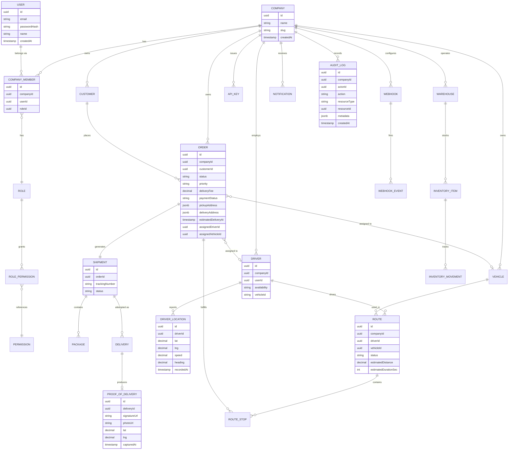

# FleetFlow — Phase 1: Architecture & Design

This is the design phase only, per your instructions. No implementation code yet — this is the document to review and approve before milestone-by-milestone build begins.

---

## 1. Product Requirements Summary

**Product:** FleetFlow — a multi-tenant logistics and order-tracking platform for SMB/mid-market delivery operations.

**Core value proposition:** real-time visibility into orders, drivers, and vehicles; optimized routing; verifiable proof of delivery; and an analytics layer that turns raw delivery events into operational metrics.

**Primary personas:**
- **Logistics company staff** (admins, ops managers, dispatchers) — run the business through the Business Dashboard.
- **Drivers** — execute deliveries through a mobile-first Driver Application.
- **End customers** — track their own shipments through a public-ish Customer Tracking Portal (no login required for basic tracking).

**Non-goals (explicitly out of scope):** full ERP/inventory system, billing/invoicing engine, HR/payroll for drivers, carrier-marketplace features (multi-carrier bidding). Inventory here is a lightweight module to support warehouse-based fulfillment, not a standalone product.

---

## 2. Feature Map

```
FleetFlow
├── Identity & Access
│   ├── Auth (email/password, OAuth, JWT+refresh)
│   ├── Multi-tenancy (Company boundary)
│   └── RBAC (6 roles, permission-checked per-endpoint)
├── Order Management
│   ├── Order CRUD + state machine
│   └── Order → Shipment → Delivery lifecycle
├── Shipment Tracking
│   ├── Public tracking page (/track/[trackingNumber])
│   └── Delivery timeline
├── Real-Time Tracking
│   ├── Driver location ingestion (WS)
│   ├── Redis pub/sub fan-out
│   └── Throttled persistence
├── Dispatch & Routing
│   ├── Driver/vehicle assignment
│   ├── Route planning + stop sequencing
│   └── Route optimization (heuristic, pluggable)
├── Fleet Management
│   ├── Drivers (availability state machine)
│   └── Vehicles (status + maintenance)
├── Warehouses & Inventory
│   ├── Warehouse CRUD
│   └── Lightweight inventory (stock in/out/transfer, low-stock alerts)
├── Proof of Delivery
│   ├── Signature/photo capture
│   └── Secure private storage (signed URLs)
├── Failed Delivery & Redelivery
│   └── Failure reasons + retry workflow
├── Notifications
│   ├── Email / in-app / SMS-abstraction
│   └── Notification center
├── Analytics
│   ├── Ops metrics dashboard
│   └── Driver performance
├── Search & Filtering
│   └── Global search, URL-persisted filters, pagination
├── Audit Log
│   └── Immutable event trail
├── Platform / Developer
│   ├── Public REST API + API keys
│   └── Webhooks (signed, retried, idempotent)
├── Event-Driven Backbone
│   └── Domain events → notifications/analytics/audit/webhooks
└── Cross-cutting
    ├── Background jobs (BullMQ)
    ├── Caching (Redis)
    ├── Observability (structured logs, request IDs)
    └── Security (see §13)
```

---

## 3. User Roles & Permissions

RBAC is enforced **server-side, per endpoint** — the UI hides controls as a convenience only. Every request resolves `(user, companyId, role) → permission check` before touching data.

| Capability | SUPER_ADMIN | COMPANY_ADMIN | OPERATIONS_MANAGER | DISPATCHER | DRIVER | CUSTOMER |
|---|---|---|---|---|---|---|
| Manage all companies | ✅ | ❌ | ❌ | ❌ | ❌ | ❌ |
| Manage company settings/users | ✅ | ✅ | ❌ | ❌ | ❌ | ❌ |
| Create/edit orders | ✅ | ✅ | ✅ | ✅ (create) | ❌ | ❌ (create own via portal, limited) |
| Assign driver/vehicle | ✅ | ✅ | ✅ | ✅ | ❌ | ❌ |
| Manage warehouses/inventory | ✅ | ✅ | ✅ | ❌ | ❌ | ❌ |
| Manage vehicles | ✅ | ✅ | ✅ | ❌ | ❌ | ❌ |
| Plan/optimize routes | ✅ | ✅ | ✅ | ✅ | ❌ | ❌ |
| Update own delivery status | ❌ | ❌ | ❌ | ❌ | ✅ (own only) | ❌ |
| Submit proof of delivery | ❌ | ❌ | ❌ | ❌ | ✅ (own only) | ❌ |
| View live map / all drivers | ✅ | ✅ | ✅ | ✅ | ❌ | ❌ |
| View own location on map | — | — | — | — | ✅ | ❌ |
| Track own shipments | ❌ | ❌ | ❌ | ❌ | ❌ | ✅ |
| View company analytics | ✅ | ✅ | ✅ | 🔶 (ops-only slice) | ❌ | ❌ |
| Manage API keys/webhooks | ✅ | ✅ | ❌ | ❌ | ❌ | ❌ |
| View audit log | ✅ | ✅ | 🔶 (read-only) | ❌ | ❌ | ❌ |

**Permission model:** implemented as `Permission` records (e.g. `order:create`, `order:assign`, `driver:location:write`) attached to `Role`, resolved via a `CompanyMember` join (`user_id, company_id, role_id`). Guards run as a NestJS `Guard` + decorator: `@RequirePermission('order:assign')`, which pulls the caller's `CompanyMember` for the target resource's `companyId` and checks the permission set — this is what makes it independent of the UI.

---

## 4. System Architecture

**Style:** Modular monolith (NestJS) at launch, structured so modules could be split into services later without a rewrite — each module owns its own DB tables, service layer, and emits domain events rather than reaching into other modules' repositories directly.

```
                         ┌─────────────────────┐
                         │   Next.js Frontend   │
                         │ (Dashboard / Driver / │
                         │   Tracking Portal)   │
                         └──────────┬───────────┘
                     HTTPS (REST)   │   WSS (Socket.IO)
                                    │
                         ┌──────────▼───────────┐
                         │     NestJS API        │
                         │  (modular monolith)   │
                         │ ┌───────────────────┐ │
                         │ │ Auth / RBAC        │ │
                         │ │ Orders / Shipments │ │
                         │ │ Drivers / Vehicles │ │
                         │ │ Routes             │ │
                         │ │ Warehouses/Inventory│ │
                         │ │ Tracking (WS gateway)│ │
                         │ │ Notifications      │ │
                         │ │ Webhooks           │ │
                         │ │ Analytics          │ │
                         │ │ Audit              │ │
                         │ └───────────────────┘ │
                         └──────┬───────┬────────┘
                                │       │
                  ┌─────────────┘       └─────────────┐
                  ▼                                    ▼
        ┌──────────────────┐                ┌───────────────────┐
        │   PostgreSQL      │                │       Redis        │
        │  (Prisma ORM)     │                │ pub/sub, cache,    │
        │  source of truth  │                │ rate limits, queues│
        └──────────────────┘                └─────────┬─────────┘
                                                        │
                                              ┌─────────▼─────────┐
                                              │  BullMQ Workers    │
                                              │ notifications,     │
                                              │ webhooks, reports, │
                                              │ location batching  │
                                              └─────────┬─────────┘
                                                        │
                                    ┌───────────────────┼───────────────────┐
                                    ▼                   ▼                   ▼
                            ┌───────────┐       ┌──────────────┐   ┌──────────────┐
                            │ S3-compat  │       │  Email/SMS    │   │ Map Provider  │
                            │  storage   │       │  providers    │   │ (Mapbox/GMaps│
                            │ (PoD files)│       │               │   │ /OSM, adapter)│
                            └───────────┘       └──────────────┘   └──────────────┘
```

**Tenant isolation** (see §5 for detail): every query is scoped by `companyId` at the Prisma-repository layer via a request-scoped `TenancyContext`, not left to each service to remember individually.

---

## 5. Multi-Tenancy & Tenant Isolation

- Every tenant-owned table carries a `companyId` foreign key (Users are tenant-scoped through `CompanyMember`, since a `SUPER_ADMIN` user could in theory support multiple companies).
- A **request-scoped `TenancyContext`** is populated in an auth middleware/guard from the authenticated user's JWT (`companyId` claim) or, for `SUPER_ADMIN`, from an explicit `X-Company-Id` header (audited).
- A shared **base repository** wraps Prisma calls and injects `where: { companyId: ctx.companyId }` automatically for all reads/writes on tenant-scoped models — individual services cannot "forget" the filter because they don't call `prisma.order.findMany()` directly; they call `this.orderRepo.findMany()`.
- Defense in depth: Postgres **Row-Level Security (RLS)** policies on tenant tables as a second layer, keyed off a session variable (`app.current_company_id`) set per request/transaction — so even a bug in application code can't leak cross-tenant rows.
- Composite indexes are always `(companyId, ...)` leading, so tenant filtering is also the fast path, not just a security constraint.

---

## 6. Database ERD



**Key relationship notes:**
- `Order → Shipment` is 1:1 at creation but modeled separately because a **shipment** is the trackable/physical-movement concept while an **order** is the commercial concept (payment, customer) — this separation is what lets `/track/[trackingNumber]` expose shipment data publicly without leaking order/payment fields.
- `Delivery` is separate from `Shipment` to represent **attempts** (a shipment can have multiple delivery attempts after a failure/redelivery).
- `DriverLocation` is an append-only, high-volume table — see §8/§11 for why it's *not* written on every GPS ping.
- Soft deletion (`deletedAt`) is used on `Order`, `Customer`, `Driver`, `Vehicle`, `Warehouse` — anything referenced by historical records that must remain intact for audit/analytics even after "deletion."

---

## 7. Database Schema (Prisma-style, condensed)

```prisma
model Company {
  id        String   @id @default(uuid())
  name      String
  slug      String   @unique
  createdAt DateTime @default(now())
  members   CompanyMember[]
  orders    Order[]
  drivers   Driver[]
  vehicles  Vehicle[]
  warehouses Warehouse[]
  apiKeys   ApiKey[]
  webhooks  Webhook[]
}

model User {
  id           String   @id @default(uuid())
  email        String   @unique
  passwordHash String?
  name         String
  memberships  CompanyMember[]
  createdAt    DateTime @default(now())
}

model Role {
  id          String @id @default(uuid())
  name        String @unique // SUPER_ADMIN, COMPANY_ADMIN, ...
  permissions RolePermission[]
}

model Permission {
  id    String @id @default(uuid())
  key   String @unique // "order:create", "order:assign", ...
}

model RolePermission {
  roleId       String
  permissionId String
  role         Role       @relation(fields: [roleId], references: [id])
  permission   Permission @relation(fields: [permissionId], references: [id])
  @@id([roleId, permissionId])
}

model CompanyMember {
  id        String  @id @default(uuid())
  companyId String
  userId    String
  roleId    String
  company   Company @relation(fields: [companyId], references: [id])
  user      User    @relation(fields: [userId], references: [id])
  role      Role    @relation(fields: [roleId], references: [id])
  @@unique([companyId, userId])
  @@index([companyId])
}

model Customer {
  id        String   @id @default(uuid())
  companyId String
  name      String
  email     String
  phone     String?
  deletedAt DateTime?
  orders    Order[]
  @@index([companyId])
}

model Order {
  id                  String    @id @default(uuid())
  companyId           String
  customerId          String
  status              OrderStatus @default(CREATED)
  priority             Priority   @default(STANDARD)
  pickupAddress       Json
  deliveryAddress     Json
  packageInfo         Json
  weightKg            Decimal
  deliveryFee         Decimal
  paymentStatus       PaymentStatus @default(UNPAID)
  assignedDriverId    String?
  assignedVehicleId   String?
  estimatedDeliveryAt DateTime?
  deletedAt           DateTime?
  createdAt           DateTime  @default(now())
  shipment            Shipment?
  @@index([companyId, status])
  @@index([companyId, assignedDriverId])
}

enum OrderStatus {
  CREATED CONFIRMED PICKED_UP IN_TRANSIT OUT_FOR_DELIVERY DELIVERED FAILED CANCELLED RETURNED
}

model Shipment {
  id             String  @id @default(uuid())
  orderId        String  @unique
  companyId      String
  trackingNumber String  @unique // FF-2026-8X92KQ
  status         OrderStatus
  order          Order   @relation(fields: [orderId], references: [id])
  packages       Package[]
  deliveries     Delivery[]
  @@index([trackingNumber])
}

model Delivery {
  id           String   @id @default(uuid())
  shipmentId   String
  attemptNumber Int
  status       DeliveryOutcome
  failureReason String?
  notes        String?
  driverId     String
  startedAt    DateTime?
  completedAt  DateTime?
  proof        ProofOfDelivery?
  @@index([shipmentId])
}

enum DeliveryOutcome { PENDING SUCCESS FAILED }

model ProofOfDelivery {
  id           String   @id @default(uuid())
  deliveryId   String   @unique
  signatureUrl String?
  photoUrl     String?
  lat          Decimal
  lng          Decimal
  capturedAt   DateTime @default(now())
}

model Driver {
  id           String   @id @default(uuid())
  companyId    String
  userId       String
  availability DriverAvailability @default(OFFLINE)
  currentVehicleId String?
  deletedAt    DateTime?
  locations    DriverLocation[]
  routes       Route[]
  @@index([companyId, availability])
}

enum DriverAvailability { AVAILABLE ON_DELIVERY OFFLINE ON_BREAK }

model DriverLocation {
  id         String   @id @default(uuid())
  driverId   String
  lat        Decimal
  lng        Decimal
  speed      Decimal?
  heading    Decimal?
  recordedAt DateTime
  @@index([driverId, recordedAt])
}
// Note: this table receives BATCHED writes, not every raw ping — see §11.

model Vehicle {
  id            String  @id @default(uuid())
  companyId     String
  licensePlate  String  @unique
  type          String
  capacityKg    Decimal
  status        VehicleStatus @default(AVAILABLE)
  nextMaintenanceAt DateTime?
  deletedAt     DateTime?
  @@index([companyId, status])
}

enum VehicleStatus { AVAILABLE IN_USE MAINTENANCE OFFLINE }

model Route {
  id           String  @id @default(uuid())
  companyId    String
  driverId     String
  vehicleId    String
  status       RouteStatus @default(PLANNED)
  estimatedDistanceKm Decimal
  estimatedDurationSec Int
  stops        RouteStop[]
}

enum RouteStatus { PLANNED IN_PROGRESS COMPLETED CANCELLED }

model RouteStop {
  id        String  @id @default(uuid())
  routeId   String
  orderId   String
  sequence  Int
  arrivedAt DateTime?
  @@unique([routeId, sequence])
}

model Warehouse {
  id        String  @id @default(uuid())
  companyId String
  name      String
  address   Json
  capacity  Int
  managerId String?
  deletedAt DateTime?
  inventory InventoryItem[]
}

model InventoryItem {
  id               String @id @default(uuid())
  warehouseId      String
  sku              String
  name             String
  quantity         Int
  reorderThreshold Int
  movements        InventoryMovement[]
  @@unique([warehouseId, sku])
}

model InventoryMovement {
  id        String  @id @default(uuid())
  itemId    String
  type      MovementType // IN OUT TRANSFER
  quantity  Int
  createdAt DateTime @default(now())
}

model ApiKey {
  id         String   @id @default(uuid())
  companyId  String
  hashedKey  String   @unique
  label      String
  scopes     String[]
  lastUsedAt DateTime?
  revokedAt  DateTime?
}

model Webhook {
  id         String   @id @default(uuid())
  companyId  String
  url        String
  secret     String
  events     String[]
  events_    WebhookEvent[]
}

model WebhookEvent {
  id          String  @id @default(uuid())
  webhookId   String
  eventType   String
  payload     Json
  status      WebhookDeliveryStatus @default(PENDING)
  attempts    Int @default(0)
  idempotencyKey String @unique
  @@index([webhookId, status])
}

model AuditLog {
  id           String  @id @default(uuid())
  companyId    String
  actorId      String
  action       String
  resourceType String
  resourceId   String
  metadata     Json
  createdAt    DateTime @default(now())
  @@index([companyId, resourceType, resourceId])
}
```

---

## 8. API Design

Base: `/api/v1`. Auth via `Authorization: Bearer <JWT>` (dashboard/driver/customer sessions) or `X-API-Key` (developer API). All list endpoints support `?page=&pageSize=&sort=&filter[...]=`.

| Method | Path | Auth/Role | Notes |
|---|---|---|---|
| POST | `/auth/login` | public | email/password or OAuth callback |
| POST | `/auth/refresh` | refresh token | rotates refresh token |
| POST | `/orders` | OPS_MANAGER+ | creates order in `CREATED` |
| GET | `/orders` | OPS_MANAGER+/DISPATCHER | filtered, paginated |
| GET | `/orders/:id` | tenant member (scoped) | |
| POST | `/orders/:id/assign` | DISPATCHER+ | body: `driverId, vehicleId` |
| POST | `/orders/:id/transition` | DISPATCHER+/DRIVER (own) | body: `toStatus`; validated against state machine |
| GET | `/shipments/:trackingNumber` | **public** | powers `/track/[trackingNumber]`; returns shipment-safe fields only |
| POST | `/deliveries/:id/start` | DRIVER (own) | |
| POST | `/deliveries/:id/complete` | DRIVER (own) | requires proof-of-delivery payload/reference |
| POST | `/deliveries/:id/fail` | DRIVER (own) | body: `reason, notes?, photoUrl?` |
| POST | `/proof-of-delivery/upload-url` | DRIVER (own) | returns pre-signed S3 URL |
| GET | `/drivers` | DISPATCHER+ | includes availability |
| PATCH | `/drivers/:id/availability` | DRIVER (own)/DISPATCHER | |
| GET | `/drivers/:id/performance` | OPS_MANAGER+ | |
| POST | `/vehicles` | OPS_MANAGER+ | |
| GET | `/vehicles` | OPS_MANAGER+/DISPATCHER | |
| POST | `/routes` | DISPATCHER+ | body: stops[]; triggers optimization job |
| POST | `/routes/:id/optimize` | DISPATCHER+ | recomputes stop order |
| GET | `/warehouses` | OPS_MANAGER+ | |
| POST | `/inventory/movements` | OPS_MANAGER+ | stock in/out/transfer |
| GET | `/analytics/overview` | OPS_MANAGER+ | cached (§10) |
| GET | `/notifications` | any authenticated user | own notifications |
| PATCH | `/notifications/:id/read` | owner | |
| GET | `/audit-logs` | COMPANY_ADMIN+ | |
| POST | `/webhooks` | COMPANY_ADMIN | |
| GET | `/api-keys` / `POST /api-keys` | COMPANY_ADMIN | key shown once, stored hashed |

**Public developer API** (same server, `X-API-Key` auth, rate-limited per key via Redis token bucket): `POST /api/v1/orders`, `GET /api/v1/orders`, `GET /api/v1/orders/:id`, `GET /api/v1/shipments/:trackingNumber`, `POST /api/v1/orders/:id/assign`, `POST /api/v1/webhooks`, `GET /api/v1/drivers`, `GET /api/v1/warehouses`.

**Consistent error shape:**
```json
{ "error": { "code": "ORDER_INVALID_TRANSITION", "message": "Cannot move from DELIVERED to PICKED_UP", "requestId": "..." } }
```

**Order state machine** (enforced in `OrdersService.transition()`, not left to the client):
```
CREATED → CONFIRMED → PICKED_UP → IN_TRANSIT → OUT_FOR_DELIVERY → DELIVERED
                                                     ↘ FAILED → OUT_FOR_DELIVERY (redelivery) or RETURNED
CREATED/CONFIRMED → CANCELLED
```
Any transition not in the allow-list throws `ORDER_INVALID_TRANSITION` (422) — this is a pure function unit-tested exhaustively (§43).

---

## 9. WebSocket Architecture

- **Gateway:** a single NestJS `TrackingGateway` (Socket.IO) namespaced by role: `/ws/dispatch` (dashboard, receives all company driver positions) and `/ws/driver` (driver app, sends its own position, receives its assigned order updates).
- **Auth:** JWT passed in the Socket.IO handshake `auth` payload; the gateway resolves `companyId`/`driverId` once at connection time and stores it on the socket session — every subsequent message is scoped to that identity, no per-message re-auth needed but also no way to spoof another driver's ID.
- **Rooms:** each socket joins a room `company:{companyId}` (dispatchers) or `driver:{driverId}` (that driver only). Location broadcasts to `company:{companyId}` are filtered server-side to drivers the dispatcher is authorized to see.
- **Scaling beyond one instance:** Socket.IO's Redis adapter (`socket.io-redis` / `@socket.io/redis-adapter`) is used from day one so rooms and broadcasts work correctly across multiple API instances — this is the same Redis instance used for pub/sub (§10), avoiding a second moving part.
- **Message flow (driver → dispatcher):**
  1. Driver app emits `location:update {lat, lng, speed, heading, ts}` every ~5s.
  2. Gateway validates payload, publishes to Redis channel `driver-location:{companyId}`.
  3. All API instances subscribed to that channel re-emit to their local sockets in room `company:{companyId}`.
  4. Gateway also enqueues the point for **batched persistence** (§11) — it does not write to Postgres inline on the hot path.
- **Backpressure/monitoring:** connection count, message rate, and per-driver last-seen timestamp are tracked as Prometheus-style counters (see §34) so a stalled driver feed is visible in ops.

---

## 10. Event-Driven Architecture

**Domain events** (in-process event bus via NestJS `EventEmitter2`, with an outbox pattern for anything that must survive a crash):

```
OrderCreated, OrderAssigned, OrderPickedUp, ShipmentInTransit,
DeliveryStarted, DeliveryCompleted, DeliveryFailed, DriverLocationUpdated,
DriverAvailabilityChanged, RouteOptimized, InventoryLowStock
```

**Flow:** a service method (e.g. `OrdersService.assign()`) commits its DB transaction **and** writes an `OutboxEvent` row in the *same transaction* → a background dispatcher polls/streams the outbox and emits the in-process event → subscribers react:

- `NotificationsModule` → enqueues a BullMQ job per relevant event.
- `AnalyticsModule` → increments cached counters / writes an analytics fact row.
- `AuditModule` → writes an `AuditLog` row (this listener never fails silently — audit failures alert).
- `WebhooksModule` → enqueues signed webhook delivery jobs for any company webhook subscribed to that event type.

**Why the outbox pattern:** without it, "commit order to DB" and "emit event" are two separate operations that can diverge if the process crashes between them (e.g. a webhook never fires even though the order really was created). Writing the event as a row in the same transaction as the business change makes emission at-least-once and crash-safe; the dispatcher then de-dupes via `idempotencyKey` on the consumer side (webhooks table already has this — see §7).

---

## 11. Redis Strategy

| Use | Pattern | Invalidation / TTL |
|---|---|---|
| Driver location fan-out | Pub/Sub channel `driver-location:{companyId}` | ephemeral, no persistence needed (Postgres is source of truth for history) |
| Location batching buffer | Redis List/Stream per driver, flushed by a BullMQ job every N seconds or M points | cleared on flush |
| Driver availability | Cached hash `driver:{id}:status`, read-through | invalidated on `DriverAvailabilityChanged` event; 30s TTL as safety net |
| Tracking-page data | Cached `shipment:{trackingNumber}` (status + timeline) | invalidated on any `Order`/`Delivery` status change for that shipment; 60s TTL fallback |
| Dashboard metrics | Cached `analytics:overview:{companyId}` | invalidated by scheduled recompute job (every 5 min) rather than on every event — these are expensive aggregate queries and don't need to-the-second freshness |
| Session/refresh tokens | Redis-backed session store | TTL = token lifetime |
| Rate limiting | Token bucket keyed by API key / IP, `rl:{key}:{window}` | sliding window, auto-expiring |
| BullMQ queues | Redis-backed (required by BullMQ) | job-level, not a cache concern |

**What's deliberately *not* cached:** individual order/customer records — Postgres with proper indexes is fast enough for that read pattern, and caching it introduces staleness risk for data dispatchers act on operationally. Caching is reserved for (a) genuinely hot, repeatedly-read aggregates, and (b) real-time fan-out that shouldn't touch the DB at all.

---

## 12. Background Job Architecture (BullMQ)

| Queue | Jobs | Retry policy |
|---|---|---|
| `notifications` | send email/SMS/in-app on domain events | exponential backoff, 5 attempts, dead-letter after |
| `webhooks` | deliver signed HTTP POST to company endpoint | exponential backoff, 8 attempts over ~24h, then marked `FAILED` and surfaced in dashboard |
| `location-persist` | flush buffered GPS points from Redis → `DriverLocation` in batched inserts | at-least-once; safe because inserts are idempotent-ish (unique on driver+timestamp) |
| `route-optimization` | run optimization heuristic for a route, write result | 2 retries, then flags for manual dispatch |
| `analytics-rollup` | recompute cached dashboard aggregates on a schedule | 3 retries |
| `pod-processing` | resize/validate uploaded proof-of-delivery images | 3 retries |
| `report-generation` | on-demand exportable reports | 2 retries |

All queues use BullMQ's built-in exponential backoff and a shared dead-letter queue (`*-dlq`) with an alert (log-level `error` + metric) so failed jobs are visible rather than silently dropped. Job IDs are derived from the triggering domain event's `eventId` where relevant, giving idempotent enqueue (re-processing an outbox event twice doesn't double-enqueue).

---

## 13. Security Architecture (summary — full detail goes in `SECURITY.md` at implementation time)

- **AuthN:** JWT access tokens (short-lived, ~15 min) + rotating refresh tokens (httpOnly, secure, `SameSite=Strict` cookies for the dashboard; header-based for driver/mobile clients).
- **AuthZ:** permission-guard on every controller method (§3); no endpoint trusts the frontend's role display.
- **Tenant isolation:** repository-layer `companyId` injection + Postgres RLS as defense-in-depth (§5).
- **Input validation:** class-validator DTOs on every endpoint; reject unknown fields.
- **Rate limiting:** Redis token bucket per user/API-key/IP; stricter limits on `/auth/*` and public tracking endpoint.
- **File uploads:** type/size validated server-side before issuing a pre-signed S3 URL; PoD files stored in a **private** bucket, served only via short-lived signed URLs to authorized viewers (driver who submitted it, that order's customer, company staff).
- **Secrets:** `.env` for local, a real secret manager (e.g. AWS Secrets Manager/Doppler) referenced in deployment docs — never committed.
- **API keys:** stored as salted hashes, only shown once at creation.
- **Transport/headers:** HTTPS everywhere, `helmet`-equivalent secure headers, CSRF protection on cookie-based dashboard auth (not needed for pure bearer-token API clients).
- **SQL/XSS:** Prisma parameterizes queries by default; React/Next.js escapes output by default — audited explicitly wherever `dangerouslySetInnerHTML` or raw SQL would be tempting (avoided).
- **Audit log:** append-only, written from the event bus (§10), never editable via API.

---

## 14. Observability

- **Structured logging:** JSON logs via `pino` (or Nest's logger with a JSON transport), every log line carrying `requestId`, `companyId`, `userId` where applicable.
- **Request IDs:** generated at an edge middleware, propagated through service calls and into any enqueued job payload, so a dashboard action → background job → webhook delivery can be traced end-to-end by one ID.
- **Latency tracking:** simple middleware timing per route, exported as metrics (route, method, status, duration histogram).
- **Background-job monitoring:** BullMQ's built-in dashboard (Bull Board) mounted at an internal-only route; queue depth, DLQ size, and processing time tracked.
- **WebSocket monitoring:** connection count, messages/sec, last-seen-per-driver gauge.
- **Future OpenTelemetry path:** the structured logger and timing middleware are designed to be swapped for OTel SDK instrumentation later — traces would wrap the same request-ID boundary already established, and BullMQ jobs would carry trace context in their payload the same way they already carry `requestId`.

---

## 15. Folder Structure

```
fleetflow/
├── apps/
│   ├── web/                    # Next.js app (dashboard + driver + tracking + landing)
│   │   ├── app/
│   │   │   ├── (dashboard)/dashboard, orders, drivers, vehicles, routes,
│   │   │   │             warehouses, inventory, customers, analytics,
│   │   │   │             notifications, audit-logs, settings, developers, webhooks
│   │   │   ├── (driver)/driver, driver/deliveries, driver/deliveries/[id], driver/profile
│   │   │   ├── track/[trackingNumber]/
│   │   │   └── (marketing)/ (landing page)
│   │   ├── components/
│   │   ├── lib/ (api client, socket client, auth)
│   │   └── stores/ (zustand)
│   └── api/                    # NestJS backend
│       └── src/
│           ├── modules/
│           │   ├── auth/
│           │   ├── companies/
│           │   ├── orders/
│           │   │   ├── controller / service / repository / dto / domain / events
│           │   ├── shipments/
│           │   ├── drivers/
│           │   ├── vehicles/
│           │   ├── routes/
│           │   ├── warehouses/
│           │   ├── inventory/
│           │   ├── tracking/ (WS gateway)
│           │   ├── notifications/
│           │   ├── webhooks/
│           │   ├── analytics/
│           │   └── audit/
│           ├── common/ (guards, decorators, filters, interceptors)
│           ├── config/
│           └── main.ts
├── packages/
│   ├── shared-types/           # DTOs/enums shared between web & api
│   └── map-adapter/            # Mapbox/GMaps/OSM provider abstraction
├── prisma/
│   ├── schema.prisma
│   └── migrations/
├── docker/
│   ├── Dockerfile.web
│   ├── Dockerfile.api
│   └── docker-compose.yml
├── .github/workflows/ci.yml
├── .env.example
└── README.md
```

---

## 16. UI Sitemap

```
Public
 ├── / (landing)
 ├── /track/[trackingNumber]
 └── /auth/login, /auth/register

Business Dashboard (role-gated)
 ├── /dashboard              — operations command center (map + metrics)
 ├── /operations             — alias/expanded ops view
 ├── /orders, /orders/[id]
 ├── /shipments, /shipments/[trackingNumber]
 ├── /drivers, /drivers/[id]
 ├── /vehicles
 ├── /routes
 ├── /warehouses
 ├── /inventory
 ├── /customers
 ├── /analytics
 ├── /notifications
 ├── /audit-logs
 ├── /settings
 ├── /developers            — API keys
 └── /webhooks

Driver App (mobile-first)
 ├── /driver                 — today's summary
 ├── /driver/deliveries
 ├── /driver/deliveries/[id] — map, actions, PoD capture
 └── /driver/profile

Customer Portal
 └── (mostly the public /track page; an optional lightweight
     /account/orders view for registered customers)
```

---

## Development Roadmap (milestones for the build phase)

1. **Foundations** — monorepo scaffold, Docker Compose (Postgres/Redis), Prisma schema + migrations, base NestJS module structure, CI skeleton.
2. **Auth & Multi-tenancy** — JWT/refresh auth, Company/CompanyMember/Role/Permission, tenancy guard + RLS, seed script.
3. **Orders & Shipments** — order CRUD, state machine, shipment/tracking-number generation, public tracking endpoint.
4. **Drivers, Vehicles, Assignment** — driver/vehicle CRUD, availability state machine, assignment rules/guards.
5. **Real-time tracking** — WS gateway, Redis pub/sub, location batching job, live map on dashboard.
6. **Routes** — route/stop model, manual route builder UI, heuristic optimization job.
7. **Proof of Delivery & Failed Deliveries** — S3 signed uploads, PoD capture flow, failure/redelivery workflow.
8. **Notifications** — event bus + outbox, BullMQ notification jobs, notification center UI.
9. **Analytics** — cached aggregate queries, dashboard charts, driver performance page.
10. **Search, filtering, audit log** — global search, URL-persisted filters, immutable audit trail.
11. **Public API & Webhooks** — API keys, rate limiting, signed/retried webhook delivery.
12. **Landing page & polish** — marketing site, loading/empty/error states everywhere, demo-data seeding.
13. **Testing pass** — unit (state machine, permissions, route calc), integration, Playwright E2E happy path.
14. **DevOps & docs** — finalize CI/CD, `.env.example`, `SECURITY.md`, README with ERD/diagrams/screenshots, resume content.

---

**This concludes Phase 1.** Everything above is design-only — no application code has been written yet, per your instructions. Let me know what to adjust (stack substitutions, role changes, scope trims, etc.), and once you approve, we start Milestone 1.
