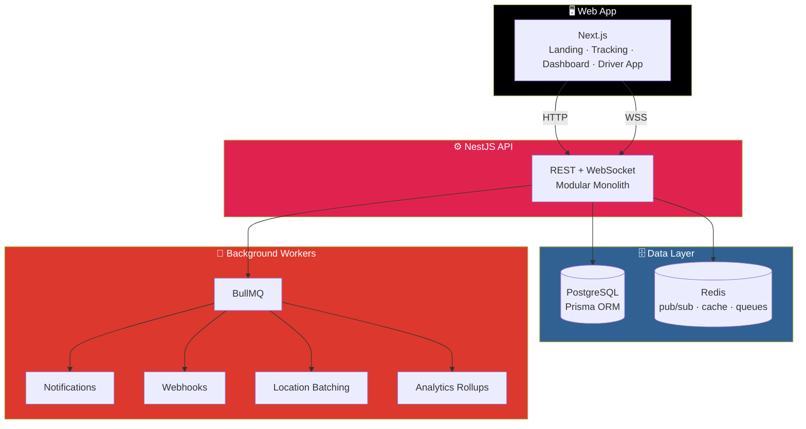

# 🚚 FleetFlow

<div align="center">


**A multi-tenant logistics and order-tracking platform.**

*A portfolio project demonstrating full-stack, real-time, and distributed-systems engineering.*

[🏗️ Architecture](#-architecture) • [✅ What's Implemented](#-whats-implemented) • [🚀 Running Locally](#-running-locally) • [🧠 Engineering Decisions](#-engineering-decisions--trade-offs) • [🗺️ Roadmap](#-not-yet-implemented)

</div>

---

> ⚠️ **Status: Early Scaffold (Milestones 1–2)**
>
> Auth, tenancy/RBAC, orders with a validated state machine, public shipment tracking, real-time driver location via WebSockets + Redis, route optimization, inventory, notifications, webhooks, and analytics are **stubbed or implemented at a foundational level**. See [What's Implemented](#-whats-implemented) for the honest current state.

---

## 📖 Overview

**FleetFlow** lets a logistics company manage orders, drivers, vehicles, warehouses, and routes. It gives customers a **public shipment-tracking page**, and gives dispatchers a **live map of their fleet**.

Full product requirements and design rationale live in [`FleetFlow-Architecture.md`](FleetFlow-Architecture.md) — the Phase 1 design doc this build follows.

### What It Demonstrates

- **Multi-tenant architecture** with defense-in-depth tenant isolation
- **Real-time systems** — WebSocket fan-out for live driver locations
- **Distributed systems** — Redis pub/sub, BullMQ queues, scheduled workers
- **Domain-driven design** — an exhaustively tested order state machine
- **Pragmatic scaling** — bounded write amplification through Redis batching

---

## 🏗️ Architecture



### Core Architectural Decisions

**🔐 Tenant Isolation — Defense in Depth**

- Application-layer `companyId` scoping on every query
- Postgres **Row-Level Security** (`prisma/rls.sql`) as a safety net
- Neither layer alone is trusted

**🛡️ RBAC — Server-Side, Always**

- Permission guard on **every endpoint** (`@RequirePermission`)
- Never just hidden in the UI

**📡 Real-Time Tracking — Bounded Write Amplification**

- Driver GPS pings buffer in **Redis**
- Fan out to dispatchers via **Socket.IO + Redis pub/sub**
- **Batch-persist to Postgres every 10 seconds** — never one DB write per ping

**📦 Order Lifecycle — Single Source of Truth**

- A pure, exhaustively unit-tested **state machine**
- `apps/api/src/modules/orders/domain/order-state-machine.ts`
- The **only** place valid status transitions are defined

> 📖 **Full detail** — ERD, API design, event architecture, Redis strategy, security model, and folder structure — is in [`FleetFlow-Architecture.md`](FleetFlow-Architecture.md).

---

## ✅ What's Implemented

### 🔐 Authentication & Tenancy

- [x] Register / login / refresh
- [x] bcrypt password hashing + JWT
- [x] Multi-tenancy with `companyId` scoping
- [x] RBAC guard + decorator
- [x] Row-Level Security policy script

### 📦 Orders & Operations

- [x] Create, list, assign
- [x] **Concurrency-safe driver assignment** via serializable transaction
- [x] Validated state transitions
- [x] Public shipment tracking endpoint
- [x] Public tracking page (`/track/[trackingNumber]`)
- [x] Drivers, vehicles, warehouses, inventory: CRUD + availability/status

### 🗺️ Routing & Tracking

- [x] **Nearest-neighbor route optimization** heuristic (unit tested, swappable)
- [x] WebSocket gateway for real-time updates
- [x] Redis-buffered location ingestion
- [x] Scheduled batch-persistence job

### 🔔 Events & Analytics

- [x] Event-driven notifications
- [x] BullMQ-backed webhook delivery with **HMAC signing**
- [x] Redis-cached analytics overview endpoint
- [x] Event-driven, **append-only audit log**

### 🖥️ Web App

- [x] Landing page
- [x] Tracking page
- [x] Dashboard shell
- [x] Driver app shell

### 🛠️ Infrastructure

- [x] Docker Compose
- [x] Dockerfiles
- [x] GitHub Actions CI
- [x] Prisma seed script with demo data

---

## 🚀 Running Locally

### Prerequisites

- Node.js 18+
- PostgreSQL
- Redis
- Docker *(optional — for full-stack run)*

### Setup

```bash
# 1. Configure environment
cp .env.example .env          # fill in secrets

# 2. Install dependencies
npm install

# 3. Set up the database
npm run prisma:generate
npm run prisma:migrate
npm run prisma:seed           # creates demo@fleetflow.com / DemoPass123!
```

### Run in Separate Terminals

```bash
npm run dev:api               # http://localhost:4000
npm run dev:web               # http://localhost:3000
```

### Or — Full Stack via Docker

```bash
docker compose -f docker/docker-compose.yml up --build
```

### Post-Migration: Apply Row-Level Security

After your first migration, apply the RLS policies:

```bash
psql "$DATABASE_URL" -f prisma/rls.sql
```

---

## 🧪 Testing

```bash
npm run test -w apps/api      # order state machine, route optimization heuristic, etc.
```

**What's covered:**

- Order state machine — valid and invalid transitions
- Route optimization heuristic — nearest-neighbor correctness
- *(More being added — see roadmap)*

---

## 🔧 Environment Variables

See [`.env.example`](.env.example) for the full list:

| Category | Variables |
|----------|-----------|
| **Database** | `DATABASE_URL` |
| **Cache / Queues** | `REDIS_URL` |
| **Auth** | `JWT_SECRET`, `JWT_REFRESH_SECRET` |
| **OAuth** | Provider credentials |
| **Storage** | `S3_*` (bucket, region, keys) |
| **Map Provider** | API key |
| **Email / SMS** | Provider credentials |

---

## 🧠 Engineering Decisions & Trade-offs

Every non-obvious choice in FleetFlow is deliberate. Here's the reasoning.

### 🏛️ NestJS Modular Monolith, Not Microservices

**Decision:** One deployable NestJS app with strict module boundaries.

**Why:**

- Realistic for a solo-developer project — you can actually run it
- Module boundaries (each owns its own service / repository / DTOs and talks to others only via domain events) keep the door open to splitting services later
- No premature operational complexity

### 📡 Redis Buffering for GPS Pings

**Decision:** Buffer location pings in Redis, batch-persist to Postgres every 10 seconds.

**Why:**

- Writing every location ping straight to Postgres **doesn't scale past a handful of drivers**
- Batching through Redis and flushing on a schedule **bounds write amplification**
- Dispatchers still get real-time updates via Socket.IO fan-out

### 🗺️ Nearest-Neighbor Route Heuristic

**Decision:** Use a nearest-neighbor heuristic, isolated behind a pure function.

**Why:**

- True route optimization is **NP-hard**
- A heuristic is realistic for a portfolio project
- The pure function boundary means a real solver (OR-Tools, a mapping provider's optimization API) can replace it **without touching callers**

### 🛡️ RLS as Defense-in-Depth, Not the Only Tenant Guard

**Decision:** Application-layer scoping **and** Postgres Row-Level Security.

**Why:**

| Approach | Weakness |
|----------|----------|
| **RLS alone** | Makes debugging harder; doesn't scope query planning |
| **App-layer scoping alone** | No safety net for a missed filter |
| **Both together** | Costs little; closes the gap on both sides |

---

## 🗺️ Not Yet Implemented

### Roadmap — Next Milestones

- [ ] **Proof-of-delivery capture UI** + S3 signed-upload flow
- [ ] **Failed-delivery / redelivery workflow** UI
- [ ] **Full dashboard pages** beyond the shell:
  - Orders table
  - Driver detail
  - Route builder UI
  - Live map rendering
- [ ] **Outbox pattern** for crash-safe event dispatch *(events currently emit in-process — see `SECURITY.md` known gaps)*
- [ ] **Playwright E2E suite**
- [ ] **OpenTelemetry** integration

---

## 📚 Resume / Interview Content

See [`FleetFlow-Architecture.md`](FleetFlow-Architecture.md) §46 for prepared interview-answer topics:

- Scaling GPS updates
- Tenant isolation
- Concurrent driver assignment
- Route optimization
- Disaster recovery

> Resume bullets and a GitHub description will be finalized once the remaining milestones land.

---

## 🤝 Contributing

Contributions are welcome. Please:

1. Fork the repository
2. Follow the existing module boundaries — modules talk to each other via domain events, not direct imports
3. Add tests for any new behavior
4. Preserve the tenant-isolation guarantees (app-layer scoping **and** RLS)
5. Submit a Pull Request

### Guidelines

- **Server is the source of truth** — never trust client input for tenancy, permissions, or state
- **Every endpoint is permission-guarded** — not hidden in the UI
- **Never bypass the state machine** for order transitions
- **Never write directly to Postgres from a high-frequency path** without considering batching

---

## 📄 License

MIT — see [LICENSE](LICENSE) for details.

---

<div align="center">

### 🚚 ORDERS. DRIVERS. ROUTES. REAL-TIME.

**Built to demonstrate full-stack, real-time, and distributed-systems engineering.**

<br>

⭐ If this project helped you, consider giving it a star.

<br>

[⬆ Back to Top](#-fleetflow)

</div>
